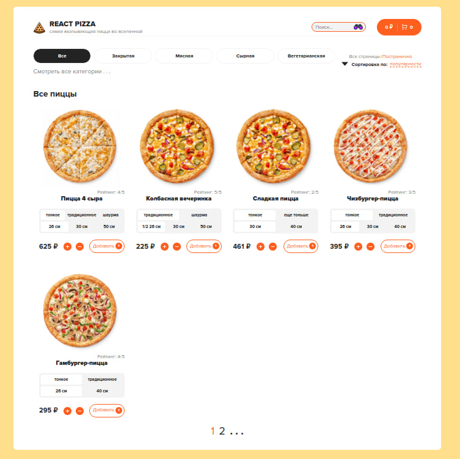

# React pizza - site about pizzas    
 
React pizzas has built on react by using webpack

You can see site on this link - https://reactpizzas.netlify.app/




## Table of Contents

+ [Main Technologies](#Main-Technologies) 
+ [Introduction](#Introduction)
+ [Usage](#Usage)
+ [Run project](#Run-project)
  + [Development](#Development)
    + [Middleware](#Middleware)
  + [Production](#Production)
+ [Roadmap](#Roadmap)
+ [License](#License) 
+ [Project status](#Project-status) 


## Main Technologies 

+ Webpack 5.74
+ React 18.2
+ Redux 4.2
+ Redux Toolkit 1.9
+ TypeScript 4.9
+ Cypress 12.2
+ Jest 29.3


## Introduction

Application has built with webpack. Were used eslint, stylint, prettier during building project their configs is shown in the project. Data fetching with axios. Sort filters works on the frontend side.
Added many jest tests for components and a little bit e2e tests. E2e tests can be run by using script that located on path - ./scripts/run-local-e2e-tests.sh
Added storybook for component library. There was added own config for storybook which add supports for scss and module.scss files and also svg as a components.
Added react route for going through pages without reload.

Backend server for pizzas and types(it means meat, cheese or fish and etc.) have located at https://reactpizzas.ru on port 5000. You can also see code for backend on this repository https://github.com/bot1291/Back-React-Pizza. 

This application has configured with CI CD by using github actions. There is check for any linting and types format and then jest and automatic cypress tests. Deployment take place on Netlify, link has introduced above.


## Usage

In application you can see different pizzas. You can choose whatever you want pizza then go to the cart page and order it.
 


Pizza state as a dough or size saves after realoding. 
 

You can choose by yourself what you want all pizzas at once or page by page. And also other things that you can check.
 


## Run project


### Development 

As written above you can run e2e test without needing to start server. For this you should run code below

```
chmod +x scripts/run-local-e2e-tests.sh
```

This will add permision to use this command. And then run tests.

```
./scripts/run-local-e2e-tests.sh
```

#### Middleware

After clone repository you can set husky.
 
```
npm run prepare
```

And then start project locally.

```
npm run dev
```


### Production 

```
npm run build
```

## Roadmap

+ Add docker support
+ Move sort filters on the backend side


## License

This project is licensed under the terms of the MIT license.


## Project status

Projest building is on active.
